---

---

<h1 id="building-a-blog-with-gatsby--graphql">Building A Blog With Gatsby &amp; GraphQL</h1>

Building a custom blog doesn’t have to be hard, and you don’t have to do all of the hard work from scratch!

Gatsby, a static site generator for React, is an amazing tool that comes pre-configured with GraphQL and it allows you to easily get up and running.

<h2 id="foundational-knowledge">Foundational Knowledge</h2>

Since Gatsby is a static site generator for React, you should have some React knowledge prior to taking this tutorial.

You should also be familiar with how to use the command line / terminal as we’ll be installing some packages with npm.

<h2 id="setup">Setup</h2>

We need to install the Gatsby CLI (command-line-interface) to build new Gatsby projects.

To install the Gatsby CLI tool, run the following <code>npm</code> command:

<pre><code>npm install -g gatsby-cli
</code></pre>
<h2 id="building-a-blog-the-short-way">Building A Blog: The Short Way</h2>

Gatsby has a series of starter files called <a href="https://www.gatsbyjs.org/starters/?v=2">Gatsby Starters</a> which allow you to quickly spin up different types of Gatsby sites.

Gatsby provides a <a href="https://www.gatsbyjs.org/starters/gatsbyjs/gatsby-starter-blog/">starter blog</a> which you can use to quickly get up-and-running.

<strong><em>If you aren’t familiar with Gatsby or GraphQL, I recommend following the in-depth tutorial to learn the in-and-outs.</em></strong>

To build a blog with the blog starter, simply run:

<pre><code>gatsby new &lt;&lt;my-blog-name&gt;&gt; https://github.com/gatsbyjs/gatsby-starter-blog
</code></pre>

Then add your markdown blog files and customize to your heart’s content.

<h2 id="building-a-blog-the-long-but-in-depth-way">Building A Blog: The Long (But In-Depth) Way</h2>

Let’s walk through the steps of building a Gatsby blog from scratch using the default starter.

First, create your starter project by running

<pre><code>gatsby new &lt;&lt;my-blog-name&gt;&gt; &amp;&amp; cd &lt;&lt;my-blog-name&gt;&gt;
gatsby develop
</code></pre>

When you open <code>localhost:8000</code> in your browser, you will see the Gatsby default application.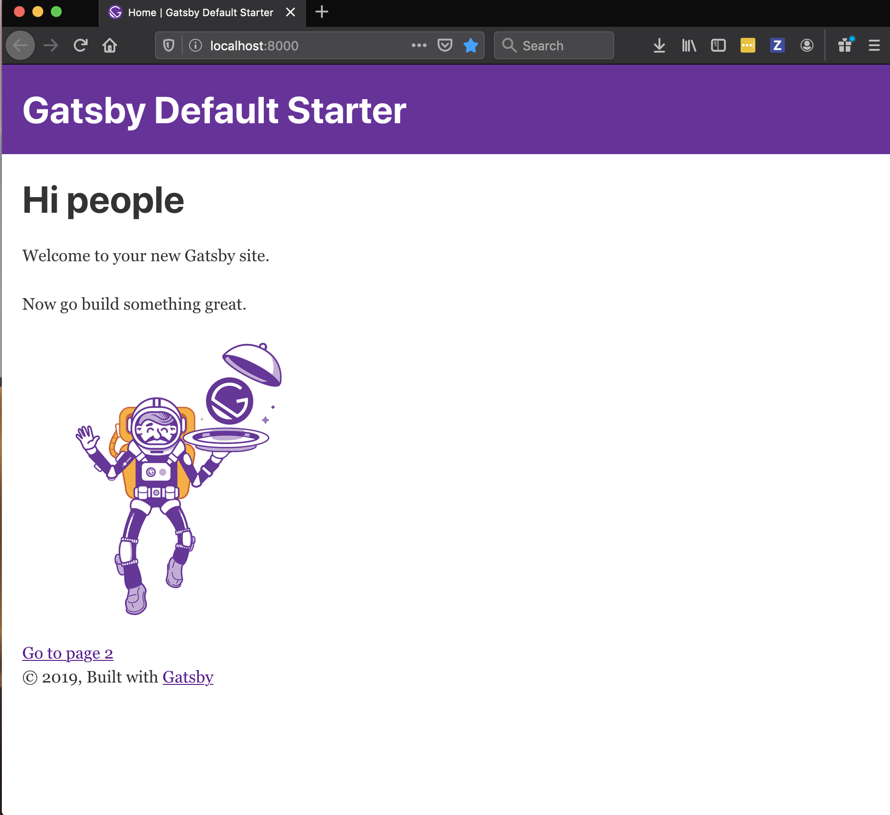 
Let’s go ahead and remove all of the boilerplate. We will leave the current file structure inside of the <code>src/</code> directory but remove all of the files inside.

<pre><code>rm -rf src/**/*.*
</code></pre>
<h3 id="gatsby-architecture">Gatsby Architecture</h3>

Since Gatsby is a static site generator for React, you can write simple React components, like you would do with create react app.

Here is the current architecture of our application:

<ul>
<li><code>components/</code> : Contains all of your React components (i.e. navigation).</li>
<li><code>pages/</code> : Contains all pages with unique routes: any JavaScript file located in this directory will be accessible through its own URL <code>my-website/&lt;&lt;page-name&gt;&gt;</code></li>
<li><code>images/</code> : Contains all image assets for our project.</li>
</ul>
<h3 id="structure">Structure</h3>

Let’s go ahead and add some of the files that we’ll need to build our blog.

Our blog will have four pages:

<ul>
<li>Home</li>
<li>About</li>
<li>Blog</li>
<li>Contact</li>
</ul>

Let’s create a JavaScript file for each of these pages inside of the <code>pages</code> directory:

<ul>
<li><code>index.js</code></li>
<li><code>about.js</code></li>
<li><code>blog.js</code></li>
<li><code>contact.js</code></li>
</ul>

Since we also removed all of the images from our project, we need to remove the reference to <code>gatsby-icon</code> to fix our development server.

Inside <code>gatsby-config.js</code>, remove the icon from the <code>options</code> object.

<pre class=" language-json"><code class="prism  language-json">// delete me
icon: `src/images/gatsby-icon.png`
</code></pre>

To check whether everything is working as expected, let’s have <code>index.js</code> in the <code>pages/</code> directory return some simple JSX.

<pre class=" language-jsx"><code class="prism  language-jsx">// pages/index.js
import React from  "react"
const Home  =  ()  =&gt; (
  &lt;div&gt;
     &lt;h1&gt;Home&lt;/h1&gt;
  &lt;/div&gt;
);

export  default Home
</code></pre>

When we restart our development server and head to our browser, we should see this:

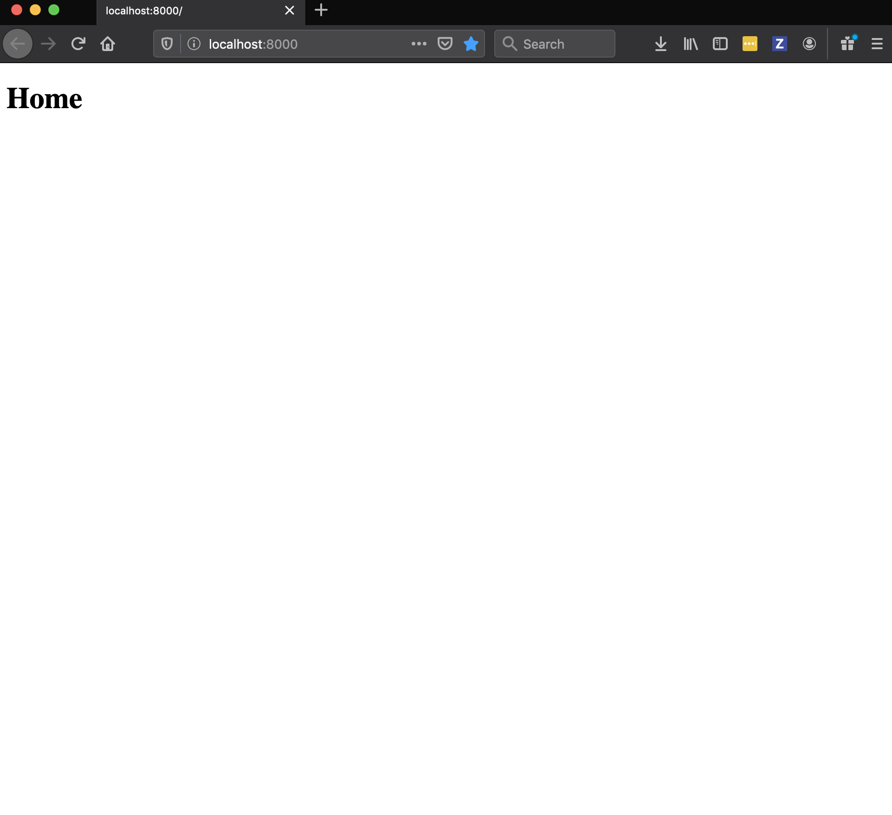

Let’s add similar JSX into the other three page components:

<pre class=" language-jsx"><code class="prism  language-jsx">// pages/about.js
import React from "react"

const About  =  ()  =&gt; (
  &lt;div&gt;
     &lt;h1&gt;About&lt;/h1&gt;
  &lt;/div&gt;
);

export  default About
</code></pre>
<pre class=" language-jsx"><code class="prism  language-jsx">// pages/blog.js
import React from "react"

const Blog  =  ()  =&gt; (
  &lt;div&gt;
     &lt;h1&gt;Blog&lt;/h1&gt;
  &lt;/div&gt;
);

export  default Blog
</code></pre>
<pre class=" language-jsx"><code class="prism  language-jsx">// pages/contact.js
import React from "react"

const Contact  =  ()  =&gt; (
  &lt;div&gt;
     &lt;h1&gt;Contact&lt;/h1&gt;
  &lt;/div&gt;
);

export  default Contact
</code></pre>

If we head back to the browser and add a <code>/about</code> to the end of our <code>localhost</code> URL, we should see the about page. Likewise this will work for <code>/blog</code> and <code>/contact</code>.

So all of our pages are rendering, but wouldn’t it be nice if we had a navigation component we could use to switch between page views? Let’s build one!

<h3 id="navigation">Navigation</h3>

First let’s create two new files in the <code>components/</code> directory: <code>Nav.js</code> and <code>nav.css</code> .

Inside <code>Nav.js</code> add the following code:

<pre class=" language-jsx"><code class="prism  language-jsx">// Nav.js
import React from  "react"

const  Nav  =  ()  =&gt; (
  &lt;nav&gt;
    &lt;ul&gt;
      &lt;li&gt;
        &lt;a  href="/"&gt;Home&lt;/a&gt;
      &lt;/li&gt;
      &lt;li&gt;
        &lt;a  href="/about"&gt;About&lt;/a&gt;
      &lt;/li&gt;
      &lt;li&gt;
        &lt;a  href="/blog"&gt;Blog&lt;/a&gt;
      &lt;/li&gt;
      &lt;li&gt;
        &lt;a  href="/contact"&gt;Contact&lt;/a&gt;
      &lt;/li&gt;
    &lt;/ul&gt;
  &lt;/nav&gt;
)
export  default Nav
</code></pre>

Since we want the navigation bar on every single page, we could import it to each individual page and render it, however there’s an easier way.

We can use a <code>&lt;Layout&gt;</code> component to ensure our navigation is rendered on each page, without having to manually import and render it for each one.

This is what our <code>&lt;Layout&gt;</code> component will look like:

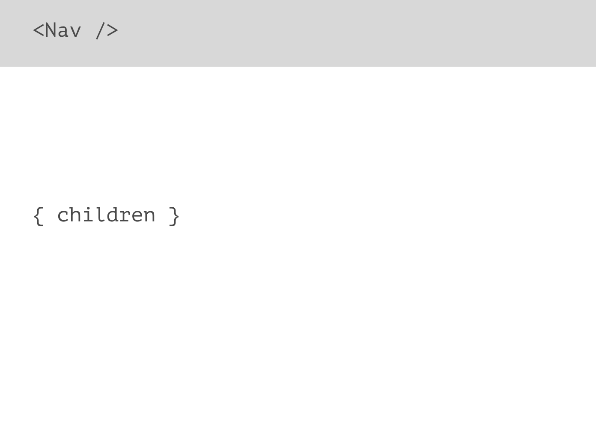

The navigation bar will sit at the top of the page, and all of the page content will be rendered in a <code>&lt;main&gt;</code> element beneath.

Inside <code>components/</code> create <code>Layout.js</code>.

First, let’s import React, Prop Types, and our Nav component:

<pre class=" language-jsx"><code class="prism  language-jsx">// Layout.js
import React from  "react"
import PropTypes from  "prop-types"

import Nav from  "./Nav"
</code></pre>

Next, we’ll create a stateless functional React component, passing <code>children</code> as a prop.

<pre class=" language-jsx"><code class="prism  language-jsx">// Layout.js
const Layout = ({ children }) =&gt; (
  &lt;&gt;
    &lt;Nav /&gt;
    &lt;main&gt;{children}&lt;/main&gt;
  &lt;/&gt;
);

export default Layout;
</code></pre>

We also want to ensure we’re passing JSX to the <code>&lt;Layout&gt;</code> component, so we’ll use PropTypes to enforce that.

<pre class=" language-jsx"><code class="prism  language-jsx">// Layout.js
import React from  "react"
import PropTypes from  "prop-types"

import Nav from  "./Nav"

const Layout = ({ children }) =&gt; (
  &lt;&gt;
    &lt;Nav /&gt;
    &lt;main&gt;{children}&lt;/main&gt;
  &lt;/&gt;
);

Layout.propTypes = {
  children: PropTypes.node.isRequired
}

export default Layout;
</code></pre>

Let’s see if our <code>&lt;Layout&gt;</code> component works.

Back in <code>index.js</code>, let’s import our <code>&lt;Layout&gt;</code> component and render it around our page content.

<pre class=" language-jsx"><code class="prism  language-jsx">// index.js
import React from "react"
import Layout from "../components/Layout"

const Home = () =&gt; (
  &lt;Layout&gt;
    &lt;h1&gt;Home&lt;/h1&gt;
  &lt;/Layout&gt;
);

export default Home;
</code></pre>

If we head over to our browser we should see the navigation appearing above our page title:

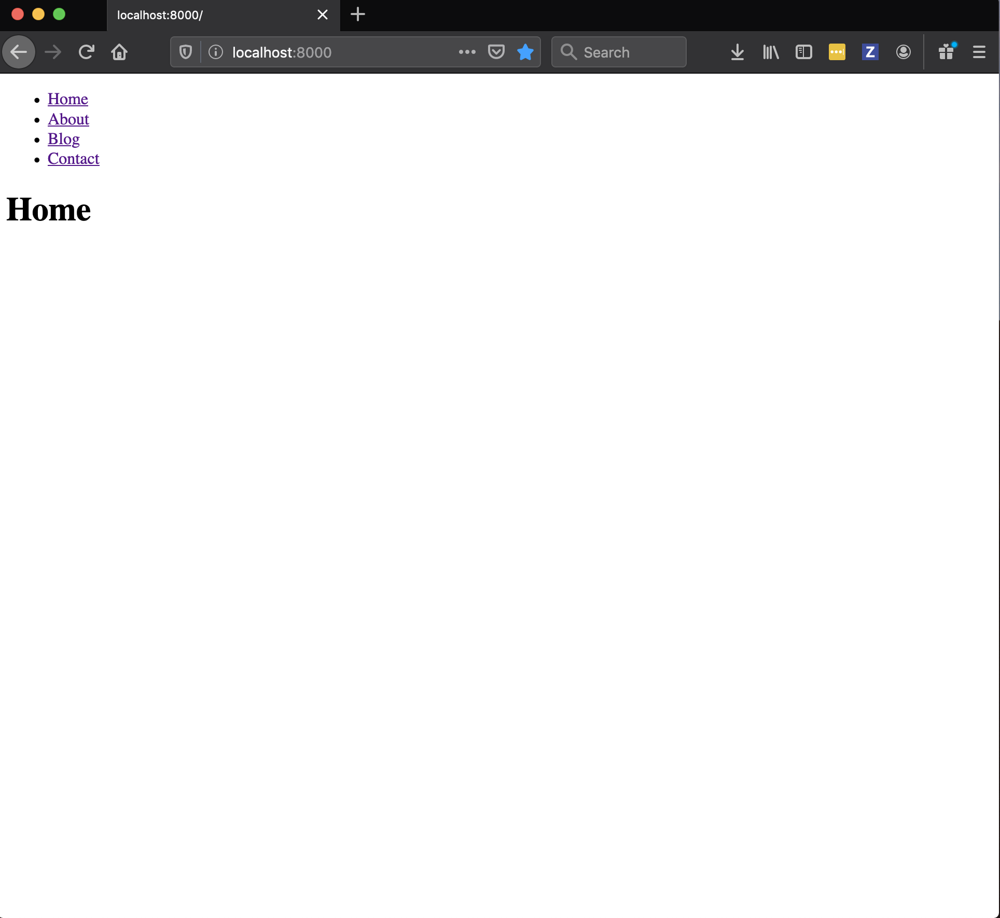

Let’s add the <code>&lt;Layout&gt;</code> component to the other three pages.

<pre class=" language-jsx"><code class="prism  language-jsx">// pages/about.js
import React from "react"
import Layout from "../components/Layout"

const About  =  ()  =&gt; (
  &lt;Layout&gt;
     &lt;h1&gt;About&lt;/h1&gt;
  &lt;/Layout&gt;
);

export  default About
</code></pre>
<pre class=" language-jsx"><code class="prism  language-jsx">// pages/blog.js
import React from "react"
import Layout from "../components/Layout"

const Blog  =  ()  =&gt; (
  &lt;Layout&gt;
     &lt;h1&gt;Blog&lt;/h1&gt;
  &lt;/Layout&gt;
);

export  default Blog
</code></pre>
<pre class=" language-jsx"><code class="prism  language-jsx">// pages/contact.js
import React from "react"
import Layout from "../components/Layout"

const Contact  =  ()  =&gt; (
  &lt;Layout&gt;
     &lt;h1&gt;Contact&lt;/h1&gt;
  &lt;/Layout&gt;
);

export  default Contact
</code></pre>

If we head back to the browser, we can now click each navigation item and see it’s respective page content.

And while this works, you’ll notice a re-render on each page. This is because we’re using the <code>&lt;a&gt;</code> tag to link between pages, and this forces a re-render.

As a solution, Gatsby provides a <code>&lt;Link&gt;</code> <a href="https://www.gatsbyjs.org/docs/gatsby-link/">component</a> to handle page routing.

Let’s head back to <code>Nav.js</code> and fix the page routing.

First let’s import Link.

<pre class=" language-jsx"><code class="prism  language-jsx">// Nav.js
import React from "react";
import { Link } from "gatsby";
</code></pre>

Next, let’s replace all <code>&lt;a&gt;</code> tags with <code>&lt;Link&gt;</code> and change the <code>href=</code> attributes to <code>to=</code> attributes.

<pre class=" language-jsx"><code class="prism  language-jsx">// Nav.js
import React from "react";
import { Link } from "gatsby";

const  Nav  =  ()  =&gt; (
  &lt;nav&gt;
    &lt;ul&gt;
      &lt;li&gt;
        &lt;Link to="/"&gt;Home&lt;/Link&gt;
      &lt;/li&gt;
      &lt;li&gt;
        &lt;Link to="/about"&gt;About&lt;/Link&gt;
      &lt;/li&gt;
      &lt;li&gt;
        &lt;Link to="/blog"&gt;Blog&lt;/Link&gt;
      &lt;/li&gt;
      &lt;li&gt;
        &lt;Link to="/contact"&gt;Contact&lt;Link&gt;
      &lt;/li&gt;
    &lt;/ul&gt;
  &lt;/nav&gt;
)
export  default Nav
</code></pre>

Switching back to the browser, the page routing should be instantaneous when we click a navigation item.

<h3 id="styling">Styling</h3>

Now that our app works, let’s add a bit of styling to make it look nicer.

<h4 id="active-link-styling">Active Link Styling</h4>

Gatsby makes it simple to add specific styles when a navigation link is active.

There are <a href="https://www.gatsbyjs.org/docs/gatsby-link/">two ways to add styles</a> to an active link:

<ul>
<li><code>activeStyle</code>: Uses inline CSS-in-JS to style an element when active.</li>
</ul>
<pre class=" language-jsx"><code class="prism  language-jsx">&lt;Link activeStyle={{ backgroundColor: 'red' }}&gt;My link&lt;/Link&gt;
</code></pre>
<ul>
<li><code>activeClassName</code>: Gives the link element a class name when active.</li>
</ul>
<pre class=" language-jsx"><code class="prism  language-jsx">&lt;Link activeClassName="active-link"&gt;My link&lt;/Link&gt;
</code></pre>

I generally  use <code>activeClassName</code> if I have multiple links, however we’ll use <code>activeStyle</code> here to demonstrate CSS-in-JS.

I’ve also added some <code>className</code> attributes to the JSX code which we’ll use to style the rest of our navigation.

<pre class=" language-jsx"><code class="prism  language-jsx">// Nav.js
import React from  "react"
import  { Link }  from  "gatsby"

import  "./nav.css"

const  Nav  =  ()  =&gt; (
  &lt;nav className="nav"&gt;
    &lt;ul className="nav-list"&gt;
      &lt;li className="nav-list-item"&gt;
        &lt;Link  
	  activeStyle={{ borderBottom:  "2px solid #a64ac9"  }} 
	  to="/"
	&gt;
            Home
        &lt;/Link&gt;
      &lt;/li&gt;
      &lt;li className="nav-list-item"&gt;
        &lt;Link  
          activeStyle={{ borderBottom:  "2px solid #a64ac9"  }}  
          to="/about"
        &gt;
            About
       &lt;/Link&gt;
     &lt;/li&gt;
     &lt;li className="nav-list-item"&gt;
       &lt;Link  
         activeStyle={{ borderBottom:  "2px solid #a64ac9"  }}  
         to="/blog"
       &gt;
           Blog
       &lt;/Link&gt;
    &lt;/li&gt;
    &lt;li className="nav-list-item"&gt;
      &lt;Link  
        activeStyle={{ borderBottom:  "2px solid #a64ac9"  }}  
        to="/contact"
      &gt;
        Contact
      &lt;/Link&gt;
    &lt;/li&gt;
  &lt;/ul&gt;
&lt;/nav&gt;
)

export  default Nav
</code></pre>

Now each link, when selected, will have an underline of <code>2px</code>.

<h4 id="navigation-styling">Navigation Styling</h4>

Inside the <code>nav.css</code> file in the <code>components/</code> directory and add the following code.

<pre class=" language-css"><code class="prism  language-css">/* nav.css */
.nav  {
  padding:  24px;
}

.nav-list  {
  list-style:  none;
  display:  flex;
  margin:  0;
  padding:  0;
}

.nav-list-item  {
  margin-right:  24px;
  font-family:  -apple-system, BlinkMacSystemFont,  "Segoe UI", Roboto, Oxygen,
       Ubuntu, Cantarell,  "Open Sans",  "Helvetica Neue",  sans-serif;
  font-size:  1.5em;
}

.nav-list  a  {
  color:  #a64ac9;
  text-decoration:  none;
  border-bottom:  2px  transparent;
  transition:  border  0.1s  linear;
}

.nav-list  a:hover,
.nav-list  a:focus  {
  border-bottom:  2px  solid  #a64ac9;
}
</code></pre>

Don’t forget to import <code>nav.css</code> in <code>Nav.js</code>:

<pre class=" language-jsx"><code class="prism  language-jsx">// Nav.js
...
import "./nav.css";
...
</code></pre>
<h4 id="layout-styling">Layout Styling</h4>

Now let’s add some styling to <code>Layout.js</code>. Create <code>layout.css</code> in the <code>components/</code> directory.

<pre class=" language-css"><code class="prism  language-css">/* layout.css */
html,
body  {
  padding:  0;
  margin:  0;
  overflow-x:  hidden;
}

.main  {
  padding:  24px;
  font-family:  -apple-system, BlinkMacSystemFont,  "Segoe UI", Roboto, Oxygen,
        Ubuntu, Cantarell,  "Open Sans",  "Helvetica Neue",  sans-serif;
  background-color:  #a64ac9;
  height:  100%;
  color:  #ffffff;
}

.main  h1  {
  font-size:  5em;
}

.main  p  {
  font-size:  2em;
}
</code></pre>

Import the CSS file into <code>Layout.js</code> and add a class name of <code>layout</code> to the outer <code>&lt;div&gt;</code> element and a class name of <code>main</code> to the <code>&lt;main&gt;</code> element.

<pre class=" language-jsx"><code class="prism  language-jsx">// Layout.js
...
import "./layout.css"
...
&lt;div className="layout"&gt;
  &lt;Nav /&gt;
  &lt;main className="main"&gt;{children}&lt;/main&gt;
&lt;/div&gt;
...
</code></pre>
<h4 id="filler-content">Filler Content</h4>

Lastly I’m going to add some filler content to <code>index.js</code>, <code>about.js</code>, and <code>contact.js</code>. I added 5 paragraphs with lorem ipsum text to each of the three pages.

<pre class=" language-jsx"><code class="prism  language-jsx">// index.js, about.js, contact.js
...
&lt;p&gt;
  Lorem ipsum dolor sit amet consectetur adipisicing elit. Ea dignissimos
  aut consequuntur aspernatur corrupti ratione, odit similique tenetur
  accusantium, est nostrum esse minus iure voluptatum nihil cumque
  blanditiis non? Odit.
&lt;/p&gt;
...
</code></pre>

Your site should now look much better!

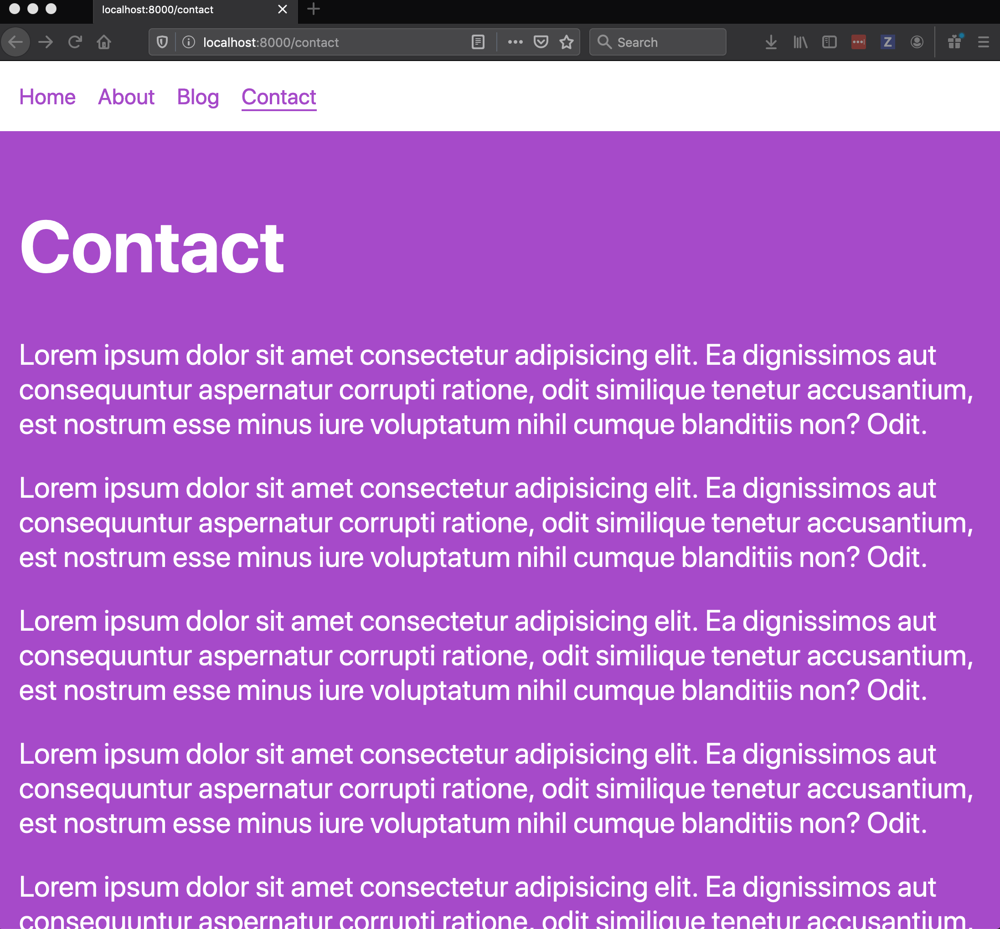

<h3 id="blogs">Blogs</h3>

Now it’s time to add some blogs!

<h4 id="adding-blog-posts">Adding Blog Posts</h4>

Inside of the <code>pages/</code> directory, create three folders: <code>2020-01-01-my-first-blog</code>, <code>2020-02-14-valentines-day</code>, <code>2020-04-01-april-fools</code>.

Inside each of these folders, add an <code>index.md</code> file with the following structure:

<pre class=" language-md"><code class="prism  language-md">---
path: '/my-first-blog'
date: '2020-01-01'
title: 'My First Blog'
author: 'Emma Bostian'
description: 'This is my very first blog of 2020!'
---

Here is my main content
It is very interesting.

Lorem ipsum dolor sit amet consectetur adipisicing elit. Ea dignissimos
aut consequuntur aspernatur corrupti ratione, odit similique tenetur
accusantium, est nostrum esse minus iure voluptatum nihil cumque
blanditiis non? Odit.
</code></pre>

Everything between the three hyphens is called frontmatter. Frontmatter is essentially metadata for your blog post.

For each blog post, add some frontmatter, containing the following data:

<ul>
<li><code>path</code>: The URL path to your blog</li>
<li><code>date</code>: The date of publish</li>
<li><code>title</code>: The blog post title</li>
<li><code>author</code>: The blog post author</li>
<li><code>description</code>: The blog post description</li>
</ul>

Everything after the closing hyphens is the main body of the blog post. You can add whatever you’d like here.

Add markdown content for each of our three blog posts.

<h4 id="rendering-a-list-of-blog-posts">Rendering A List Of Blog Posts</h4>

Now that we have markdown files, we want to render them on our <code>blog.js</code> page.

We first need to install a dependencies:

In your terminal, run the following command:

<pre><code>yarn add gatsby-transformer-remark
</code></pre>

Then, in <code>gatsby-config.js</code>, add <code>gatsby-transformer-remark</code> to the list of plugins.

<pre class=" language-js"><code class="prism  language-js">  // gatsby-config.js
  plugins: [
    ...
    `gatsby-transformer-remark`,
    ...
  ]
</code></pre>

We also need to add another plugin for <code>gatsby-source-filesystem</code> to tell GraphQL where to find our blog posts: our <code>pages/</code> directory.

<pre class=" language-js"><code class="prism  language-js">// gatsby-config.js
{
plugins: [
... 
{
  resolve:  `gatsby-source-filesystem`,
  options:  {
  name:  `pages`,
  path:  `${__dirname}/src/pages`,
  },
}
...
]
</code></pre>

Restart your development server, then head over to <code>http://localhost:8000/___graphql</code>.

Gatsby comes pre-configured with GraphQL which means we have access to GraphiQL.

To get a list of all blog posts, we’ll use the <code>AllMarkdownRemark</code> plugin. Select the following options in the Explorer panel:

<pre><code>AllMarkdownRemark &gt; edges &gt; node &gt; frontmatter &gt; date title
</code></pre>

Then press the play button.

You should see your blog post data in the right-hand panel.

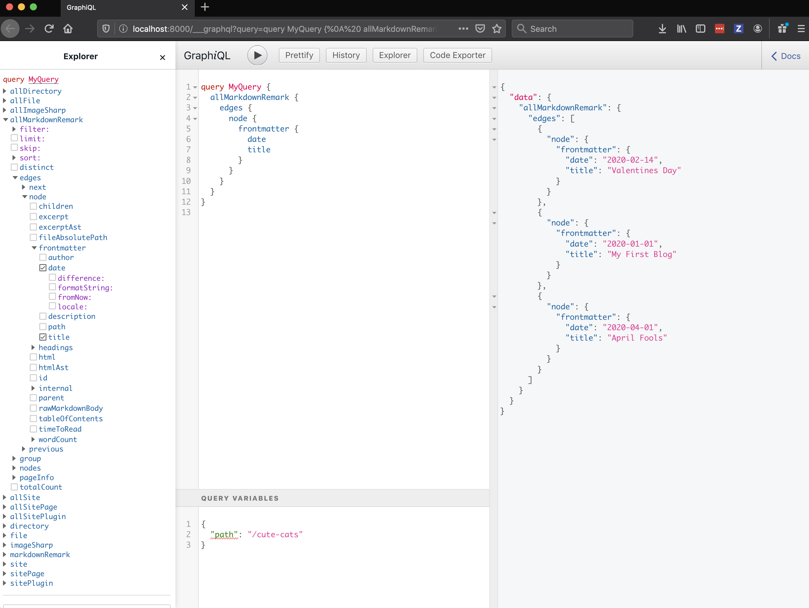

Copy this GraphQL query and head over to <code>blog.js</code>.

First, import <code>graphql</code> from <code>gatsby</code>.

<pre class=" language-jsx"><code class="prism  language-jsx">// blog.js
...
import { graphql } from "gatsby"
...
</code></pre>

Then, after the blog export, add the following code, pasting in the GraphQL query we just copied from GraphiQL where it says <code>&lt;&lt;Your code here&gt;&gt;</code>

<pre class=" language-jsx"><code class="prism  language-jsx">export const AllBlogsQuery = graphql`
  &lt;&lt;your code here&gt;&gt;
`
</code></pre>

My query looks like this (I added <code>description</code> <code>path</code>, and <code>author</code> to the list of data to retrieve from the frontmatter).

<pre class=" language-jsx"><code class="prism  language-jsx">// blog.js
export const AllBlogsQuery = graphql`
  query AllBlogPosts {
    allMarkdownRemark {
      edges {
        node {
          frontmatter {
            date
            title
            description
            author
            path
          }
        }
      }
    }
  }
`
</code></pre>

The last thing we have to do is pass <code>data</code> from the query as a parameter to the blog page. Let’s console log it to see if it’s working.

<pre class=" language-jsx"><code class="prism  language-jsx">// blog.js
...
const Blog = ({ data }) =&gt; (
  &lt;Layout&gt;
    &lt;h1&gt;Blog&lt;/h1&gt;
    { console.log(data) }
  &lt;/Layout&gt;
)
</code></pre>

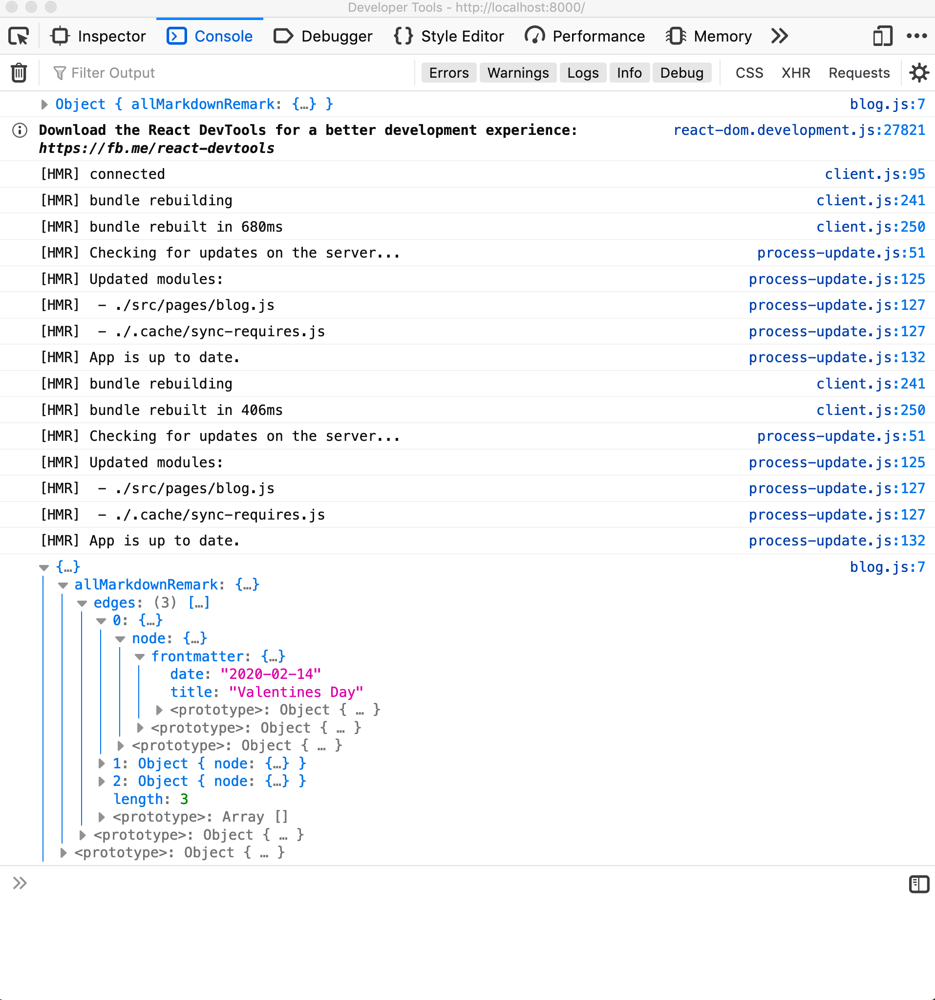

<h4 id="dynamically-creating-a-list-of-blogs">Dynamically Creating A List Of Blogs</h4>

Now let’s iterate over our blog data and create nodes for each of them.

Create two new files in the component folder called <code>Post.js</code> and <code>post.css</code>.

<code>Post</code> will take five arguments:

<ul>
<li><code>title</code></li>
<li><code>author</code></li>
<li><code>description</code></li>
<li><code>date</code></li>
<li><code>path</code></li>
</ul>
<pre class=" language-jsx"><code class="prism  language-jsx">// Post.js
import React from  "react"
import  { Link }  from  "gatsby"
import  "./post.css"

const  Post  =  ({  title,  author,  date,  description,  path  })  =&gt; (
  &lt;div  className="post"&gt;
    &lt;h3  className="post-title"&gt;{title}&lt;/h3&gt;
    &lt;p  className="post-description"&gt;{description}&lt;/p&gt;
    &lt;p  className="post-written-by"&gt;
      Written by {author} on {date}
    &lt;/p&gt;
    &lt;Link  to={path}&gt;Read more&lt;/Link&gt;
  &lt;/div&gt;
)

export  default Post
</code></pre>

Here is the styling for our blog posts:

<pre class=" language-css"><code class="prism  language-css">/* post.css */
.post {
  margin-bottom:  80px;
  padding-bottom:  80px;
  border-bottom:  2px  solid  white;
}

.post .post-title  {
  font-size:  3em;
  margin:  0;
}

.post .post-description  {
  font-size:  1.5em;
}

.post .post-written-by  {
  font-size:  1em;
}

.post a  {
  background-color:  white;
  color:  #a64ac9;
  padding:  16px  24px;
  text-decoration:  none;
  margin-top:  16px;
  display:  inline-block;
}
</code></pre>

Now we can import <code>Post</code> into <code>blog.js</code> and render a new post for each markdown file:

<pre class=" language-jsx"><code class="prism  language-jsx">// blog.js
...
import Post from  "../components/Post"

...

const  Blog  =  ({  data  })  =&gt; (
  &lt;Layout&gt;
    &lt;h1&gt;Blog&lt;/h1&gt;
    {data.allMarkdownRemark.edges.map(post  =&gt;  {
      const  {  title,  author,  date,  description,  path  }  = post.node.frontmatter

    return (
      &lt;Post
        title={title}
        author={author}
        date={date}
        description={description}
        key={`${date}__${title}`}
        path={path}
     /&gt;
    )
  })}
&lt;/Layout&gt;
)
</code></pre>

Your blog should now look like this:

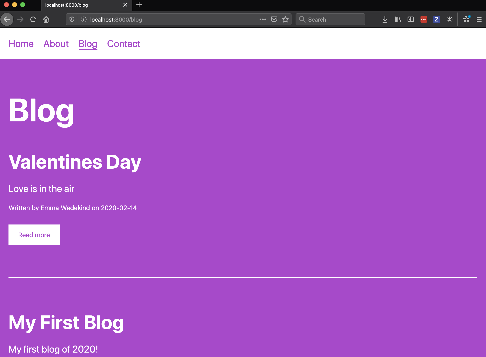

<h4 id="dynamically-generating-individual-blog-pages">Dynamically Generating Individual Blog Pages</h4>

Now that we’ve generated a list of blogs on our blog page, how can we create a page for each blog which appears when the user clicks ‘Read More’?

We could manually create a page for each post, but this would be tedious.

Luckily Gatsby, in combination with node.js, provides functionality for dynamically generating pages.

Let’s first create the GraphQL query for retrieving data for an individual blog post.

When we created the GraphQL schema for retrieving all blog posts, we used the <code>allMarkdownRemark</code> plugin.

This time, we only want the data for an individual blog post, so we’ll use the <code>markdownRemark</code> plugin.

In the Explorer panel on the left, select:

<pre><code>`markdownRemark &gt; frontmatter(purple) &gt; path &gt; eq: "_"
</code></pre>

<em>Be sure to select the purple <code>frontmatter</code> for this part of the query; it’s an argument versus a field name.</em>

This tells GraphQL that we will select a specific asset by their path, which will be passed as a parameter.

For this individual post we want to get several pieces of frontmatter data, so we’ll select

<pre><code>markdownRemark &gt; html, frontmatter (blue) &gt; author date path title
</code></pre>

<em>Be sure to select the blue <code>frontmatter</code> for this part of the query; it’s a field name versus an argument.</em>

Next, where we’re passing an argument to <code>markdownRemark</code>, we have to give GraphQL an <code>eq</code> value to look for. In our case, we’ll pass the <code>path</code> for the blog post whose content we want to display.

We first need to pass this argument to our query, before we can pass it to the <code>markdownRemark</code> plugin. You can also change the name of the query to be more semantic:

<pre class=" language-graphql"><code class="prism  language-graphql">query BlogPost($path: String!) {
   markdownRemark(frontmatter: { path: eq: $path }}) {
    frontmatter {
      author
      date
      title
      path
    }
    html
  }
}
</code></pre>

<em><code>String!</code> tells GraphQL that the path argument we’re passing is of type <code>String</code> and is required.</em>

Now let’s test if this query actually works.

If we press play, we get an error:

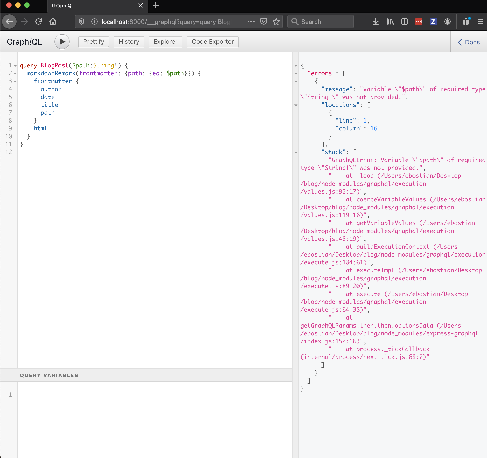

This is due to the fact that our query expects an argument but we haven’t passed it one!

Open the panel at the bottom called Query Variables and enter the following:

<pre class=" language-graphql"><code class="prism  language-graphql">{
  "path": "/april-fools"
}
</code></pre>

When we press the play  button now we get the data back for our April Fools blog.

Now that we have our query, what do we do with it?

First, let’s build a template which will denote how each blog post should be structured.

In the <code>src/</code> directory, create a new folder called <code>templates</code> and add a file inside called <code>blogTemplate.js</code>.

We first need to include some imports:

<pre class=" language-jsx"><code class="prism  language-jsx">// templates/blogTemplate.js
import React from "react"
import { graphql, Link } from "gatsby"

import Layout from "../components/Layout"
</code></pre>

Next, let’s create the function skeleton:

<pre class=" language-jsx"><code class="prism  language-jsx">// templates/blogTemplate.js
...

export default function Template({ data }) {
  return ()
}
</code></pre>

This template will take in our blog data and render it accordingly.

Finally, let’s add our GraphQL query to the bottom of the file.

<pre class=" language-jsx"><code class="prism  language-jsx">// templates/blogTemplate.js
...
export const postQuery = graphql`
query BlogPost($path: String!) {
   markdownRemark(frontmatter: { path: { eq: $path }}) {
    frontmatter {
      author
      date
      title
      path
    }
    html
  }
}
`
</code></pre>

Now let’s construct our blog post structure. First, let’s grab the <code>post</code> and the <code>title</code>, <code>author</code>, and <code>date</code> from the data.

<pre class=" language-jsx"><code class="prism  language-jsx">// templates/blogTemplate.js
...
export default function Template({ data }) {
  const post = data.markdownRemark;
  const { title, author, date } = post.frontmatter;
</code></pre>

We’ll wrap our JSX in the <code>&lt;Layout&gt;</code> component, and inside we’ll have:

<ul>
<li>A link back to the blogs page</li>
<li>The blog post title</li>
<li>The posted by with author name and date</li>
<li>A <code>&lt;div&gt;</code> containing the <code>dangerouslySetInnerHTML</code> attribute, which takes the <code>post.html</code> markup as the value.</li>
</ul>
<pre class=" language-jsx"><code class="prism  language-jsx">// templates/blogTemplate.js
...
export default function Template({ data }) {
  const post = data.markdownRemark;
  const { title, author, date } = post.frontmatter;
  
  return (
    &lt;Layout&gt;
      &lt;Link to="/"&gt;Back to blogs&lt;/Link&gt;
      &lt;h1&gt;{title}&lt;/h1&gt;
      &lt;p&gt;Posted by {author} on {date}&lt;/p&gt;
      &lt;div dangerouslySetInnerHTML={{ __html: post.html }} /&gt;
    &lt;/Layout&gt;
  )
}
...
</code></pre>

Here is the completed <code>blogTemplate.js</code> file:

<pre class=" language-jsx"><code class="prism  language-jsx">// templates/blogTemplate.js
import React from "react"
import { graphql, Link } from "gatsby"

import Layout from "../components/Layout"

export default function Template({ data }) {
  const post = data.markdownRemark;
  const { title, author, date } = post.frontmatter;
  
  return (
    &lt;Layout&gt;
      &lt;Link to="/"&gt;Back to blogs&lt;/Link&gt;
      &lt;h1&gt;{title}&lt;/h1&gt;
      &lt;p&gt;Posted by {author} on {date}&lt;/p&gt;
      &lt;div dangerouslySetInnerHTML={{ __html: post.html }} /&gt;
    &lt;/Layout&gt;
  )
}

export const postQuery = graphql`
query BlogPost($path: String!) {
   markdownRemark(frontmatter: { path: { eq: $path }}) {
    frontmatter {
      author
      date
      title
      path
    }
    html
  }
}
`
</code></pre>

Now that we have our template, let’s use it! We have to tell Gatsby to dynamically generate pages for each blog post, so let’s head over to <code>gatsby-node.js</code>.

Let’s first require the <code>path</code> module:

<pre class=" language-js"><code class="prism  language-js">// gatsby-node.js
const path = require('path')
</code></pre>

We’re going to use the <code>exports.createPages</code> <a href="https://www.gatsbyjs.org/docs/node-apis/">API</a> to dynamically generate our pages.

<pre class=" language-js"><code class="prism  language-js">// gatsby-node.js
...
exports.createPages = ({ boundActionCreators, graphql }) =&gt; {
  const { createPages } = boundActionCreators

  const postTemplate = path.resolve('src/templates/blogTemplate.js')
}  
</code></pre>

We now have to return a query to get all blog posts, so we can iterate over an generate our pages. We already have this query from a previous step, and all we need for each post is its <code>path</code>.

<pre class=" language-js"><code class="prism // language-js">  ...
  return graphql(`
    {
      allMarkdownRemark {
        edges {
          node {
            frontmatter {
              path
            }
          }
        }
      }
    }
  `)
</code></pre>

Once we receive a response back from the query, we want to reject the promise if an error occurred, and otherwise create a page for each post.

This will create a post at the designated path received from the query results, and will use the <code>postTemplate</code> we declared above (our <code>blogPost.js</code> template) to render each post.

<pre class=" language-js"><code class="prism // language-js">  ... 
  return graphql(`
    {
      allMarkdownRemark {
        edges {
          node {
            frontmatter {
              path
            }
          }
        }
      }
    }
  `).then(res =&gt; {
    if (res.errors) { return Promise.reject(res.errors) }

    res.data.allMarkdownRemark.edges.forEach(({ node }) =&gt; {
    createPage({
      path: node.frontmatter.path,
      component: postTemplate
    })
  })
</code></pre>

Here is the completed <code>gatsby-node.js</code> file:

<pre class=" language-js"><code class="prism // language-js">const path =  require("path")
exports.createPages  = ({ boundActionCreators, graphql }) =&gt; {

const { createPage } = boundActionCreators
const postTemplate = path.resolve("src/templates/blogTemplate.js")

return  graphql(`
  {
    allMarkdownRemark {
      edges {
        node {
          frontmatter {
            path
          }
        }
      }
   }
}
`).then(res =&gt; {
  if (res.errors) {
    return  Promise.reject(res.errors)
  }
  res.data.allMarkdownRemark.edges.forEach(({ node }) =&gt; {
    createPage({
      path: node.frontmatter.path,
      component: postTemplate,
    })
  })
})
}
</code></pre>

Now we’re ready to see if it worked!

Re-start your development server, then head over to the browser and click one of the blog post “Read more” links:

I’m going to add a bit more styling to make it look nicer.

I’ll create a <code>blogTemplate.css</code> file in the <code>templates/</code> directory:

<pre class=" language-css"><code class="prism  language-css">/* blogTemplate.css */
.blogTemplate  .blogTemplate-title  {
  margin:  80px  0  24px;
}

.blogTemplate  .blogTemplate-posted-by  {
  font-size:  1.2em;
}

.blogTemplate  a  {
  color:  #fff;
}
</code></pre>

Then I’ll import the CSS file into <code>blogTemplate.js</code> and add the appropriate class names. I’ll also wrap the JSX inside of <code>&lt;Layout&gt;</code> in a <code>&lt;div&gt;</code> so we can give it a class name of <code>blogTemplate</code>.

<pre class=" language-jsx"><code class="prism  language-jsx">// templates/blogTemplate.js
import React from "react"
import { graphql, Link } from "gatsby"

import Layout from "../components/Layout"

import "./blogTemplate.css"

export default function Template({ data }) {
  const post = data.markdownRemark;
  const { title, author, date } = post.frontmatter;
  
  return (
    &lt;Layout&gt;
      &lt;div className='blogTemplate'&gt;
        &lt;Link to="/blogs"&gt;Back to blogs&lt;/Link&gt;
        &lt;h1 className="blogTemplate-title&gt;{title}&lt;/h1&gt;
        &lt;p className='blogTemplate-posted-by'&gt;Posted by {author} on {date}&lt;/p&gt;
        &lt;div dangerouslySetInnerHTML={{ __html: post.html }} /&gt;
      &lt;/div&gt;
    &lt;/Layout&gt;
  )
}

export const postQuery = graphql`
query BlogPost($path: String!) {
   markdownRemark(frontmatter: { path: { eq: $path }}) {
    frontmatter {
      author
      date
      title
      path
    }
    html
  }
}
`
</code></pre>

Your blog post should look like this:

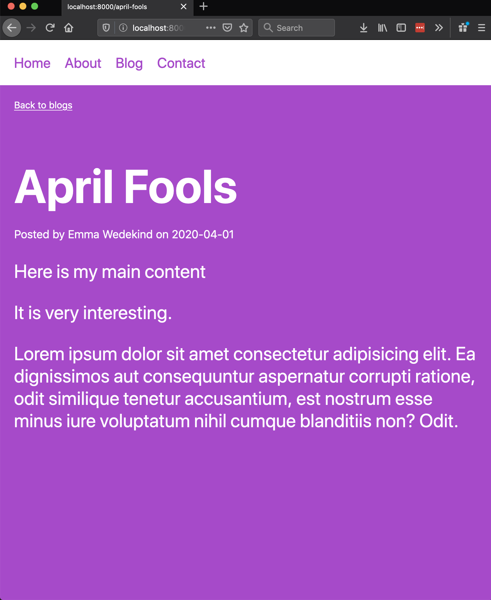

<h2 id="deploying-to-netlify">Deploying To Netlify</h2>

Now that we have a working blog, let’s deploy it to Netlify!

<h3 id="setting-up-a-github-repository">Setting Up A GitHub Repository</h3>

First, we need to establish our blog as a Git repository.

On GitHub, create a new repo:

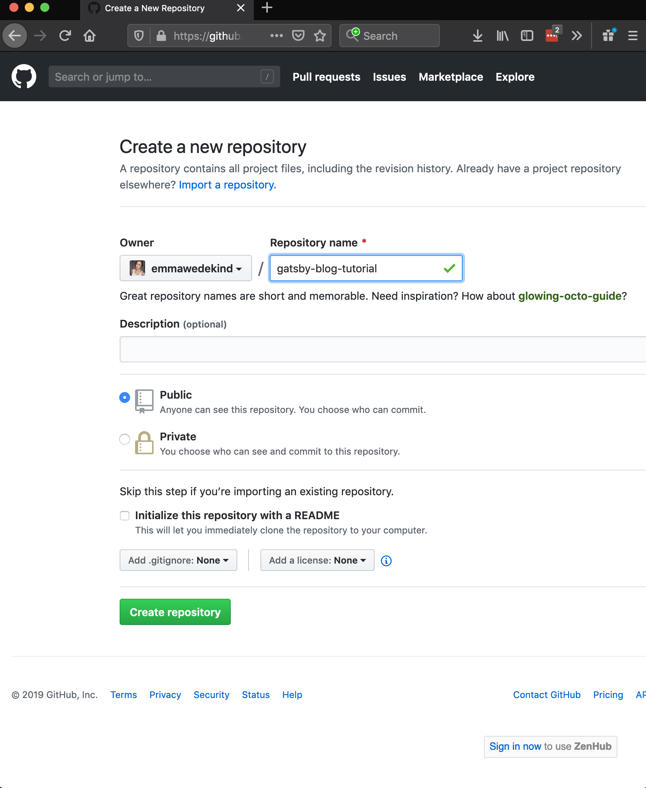

With the terminal, in the project directory run the following commands:

<pre><code>git init
git add .
git commit -m "Adding my blog files"
git remote add origin &lt;&lt;repo-link&gt;&gt;
git push -u origin master
</code></pre>
<h3 id="deploying-to-netlify-1">Deploying To Netlify</h3>

Once your code is on GitHub, it’s time to deploy!

Create an account on <a href="https://www.netlify.com/">Netlify</a> or sign in.

Click “New site from Git” and authenticate with GitHub.

Select your newly-created repository and click “Deploy.”

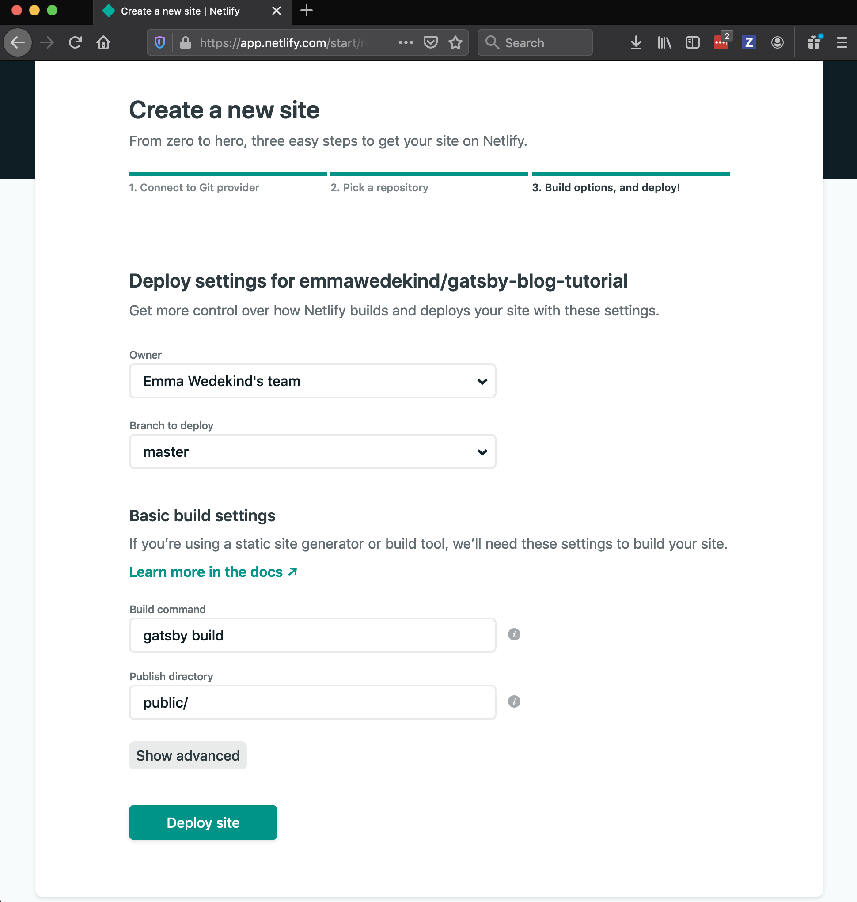

Every time you push to the master branch, your site will auto-deploy (you can change the deploy configuration but this is the default.)

You can even add a <a href="https://docs.netlify.com/domains-https/custom-domains/">custom domain</a> to really make the blog your own.

<h2 id="conclusion">Conclusion</h2>

And that’s it! I hope this was helpful to explain the process for building a blog with Gatsby.

This process is tedious, so once you understand the architecture I would recommend using the Gatsby blog starter.

Feel free to contact me on Twitter if you have any questions.

Happy blogging!

